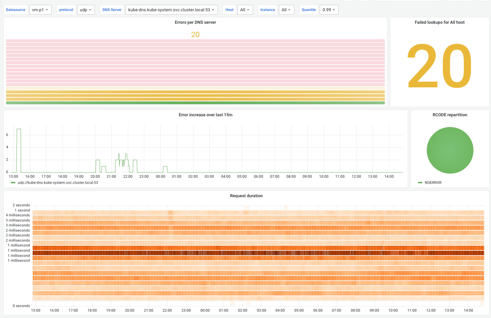

# Hostlookuper

Hostlookuper periodically performs DNS requests, measures latency and exports
the data as Prometheus metrics.

It can be used to continuously monitor a list of DNS servers and procotols, so
as to detect anomalies in the network early on. Lookup errors are logged, and
also accounted for in the `hostlookuper_dns_errors_total` metric.

###

⚠️ For the time being, and until
https://github.com/VictoriaMetrics/metrics/pull/45 is merged into
VictoriaMetrics Go instrumentation, the bucket metrics exported by hostlookuper
are only compatible with VictoriaMetrics, not prometheus.

## Usage

`hostlookuper` is configured with the follwoing arguments:

```bash
$ hostlookuper -h
Usage of hostlookuper:
  -debug
        enable verbose logging
  -dns-servers string
        comma-separated list of DNS servers. if the protocol is omitted, udp is implied, and if the port is omitted, 53 is implied (default "udp://9.9.9.9:53,udp://8.8.8.8:53,udp://one.one.one.one:53")
  -hosts string
        comma-separated list of hosts against which to perform DNS lookups (default "google.ch,ch.ch")
  -interval duration
        interval between DNS checks. must be in Go time.ParseDuration format, e.g. 5s or 5m or 1h, etc (default 5s)
  -listen string
        address on which hostlookuper listens. e.g. 0.0.0.0:9090 (default ":9090")
  -timeout duration
        maximum timeout for a DNS query. must be in Go time.ParseDuration format, e.g. 5s or 5m or 1h, etc (default 5s)
```

## Metrics

`hostlookuper` metrics are available under the `/metrics` URL. An example
`/metrics` can be found in [`doc/example_metrics`](./doc/example_metrics)


## Grafana Dashboard

A Grafana dashboard is available under [`doc/hostlookuper_grafana.json`](./doc/hostlookuper_grafana.json)


